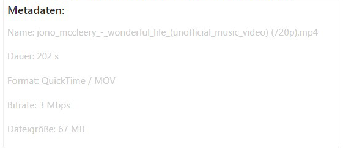
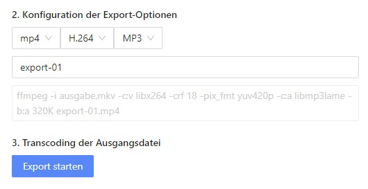

# Multimedia Wunderwerkzeug

Ein einfach konfigurierbarer WEB Transcoder für lokale Mediendateien auf Basis des Projekts von    **[xiguaxigua](https://github.com/xiguaxigua)**.  Der gesamte Encodingprozess erfolgt clientseitig im Browser und dafür wird der Web Assembly Build von `FFmpeg.wasm` verwendet.

## Funktionen

#### Medieninfo
Für das Transcoding können jede Art an Audio- und Videodaten (lokal) geladen werden. Die einzige Beschränkung bezieht sich auf die Dateigröße seitens von Web Assembly von **2 GB**.

Metadaten von der eingelesenen Datei werden mittels einem Web Assembly Build dem Medieninfo Tool [ffprobe](https://ffmpeg.org/ffprobe.html) anzeigt. _(Funktioniert leider derzeit nur mit Medien mit dem Container .mov & .mp4)._

#### Transcoding

Mit dem Konfigurator kann der gewünschte Export der Mediendatei durchgeführt werden. Dabei stehen folgende Einstellungsmöglichkeiten zur Verfügung.

+ Der Container der Mediendatei für Audio und Video
+ Video Codec
+ Audio Codec

Nach Auswahl der gewünschten Optionen wird das FFmpeg Kommando generiert (siehe Screenshot), transcodiert und nach erfolgreichem Export zum Download angeboten.

_(Das Transcoding funktioniert derzeit nur bei Videos bis zu einer Auflösung von 1920x1080px)._

## Verwendete Technologie

+ React
+ Next.js
+ Ant Design 4.x (UI)
+ FFmpeg.wasm

## Ressourcen

+ [FFmpeg.wasm](https://ffmpegwasm.netlify.app/)
+ [ffprobe-wasm](https://www.npmjs.com/package/ffprobe-wasm)
+ [ffmprovisr](https://amiaopensource.github.io/ffmprovisr/)
